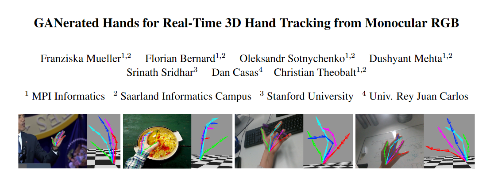

# HandTracking with Monocular RGB Camera, a University Project 
## Disclaimer

This project is a replica in Python of this article :

https://handtracker.mpi-inf.mpg.de/projects/GANeratedHands/content/GANeratedHands_CVPR2018.pdf

This project doesn't have similar real-time performances as the original one made with Caffe and C++.
Thus, it is for educational purpose only.

This project also contains files from this project :

https://github.com/Ninebell/GaneratedHandsForReal_TIME

Files reused for this project : projLayer.py & regnet.py.
Both have been modified significantly.

I encourage you to visit both projects and support their creators.

## Purpose

The purpose of this project is to replicate the architecture of the Residual Network found in the article.
The ResNet (or RegNet) is a Deep Convolutionnal Neural Network designed to track 21 points from an image of a hand.

